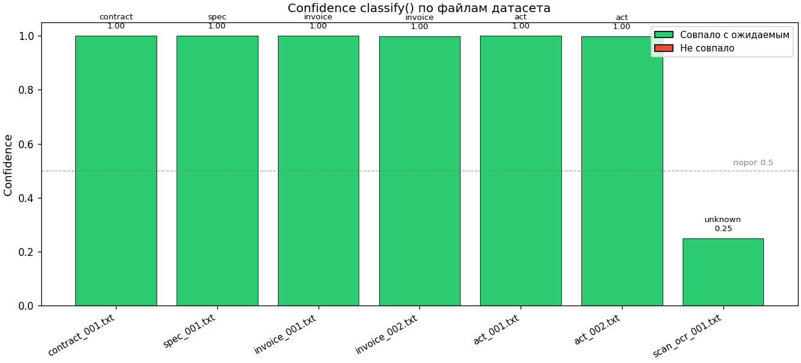
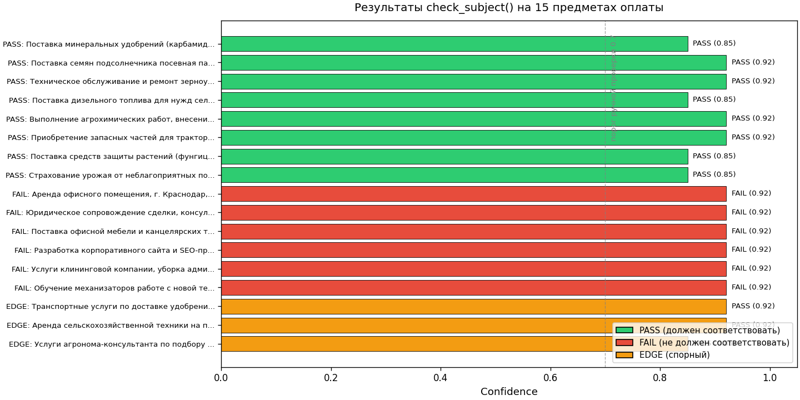
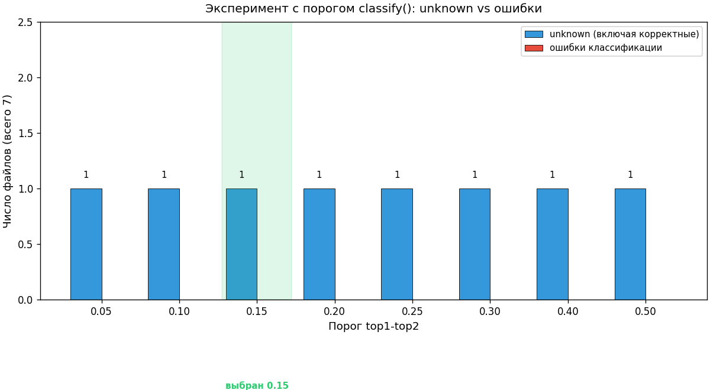

# AI-агент проверки целевого использования льготных кредитов

Тестовое задание для Data Science. Модуль интеллектуальной обработки документов:
извлечение реквизитов, классификация типа документа, проверка соответствия
предмета оплаты сельскохозяйственной льготной программе.

> Версия проекта: **v0.7.0**

[](https://www.python.org/downloads/)
[](LICENSE)
[](#51-запуск-тестов)

> ⚙️ **CI готов к активации**: workflow лежит в [`.github/ci.yml.example`](.github/ci.yml.example).
> Для активации — переименовать в `.github/workflows/ci.yml` и запушить (требуется
> токен со scope `workflow`, либо через GitHub UI).

---

## 1. Как запустить проект

**Установка и запуск тестов (2 команды):**

```bash
pip install -e ".[dev]"
pytest
```

**Опционально** — CLI, метрики, FastAPI-сервер:

```bash
# CLI-демо на одном файле
credit-check extract dataset/contract_001.txt
credit-check classify dataset/contract_001.txt
credit-check check-subject "Поставка минеральных удобрений"
credit-check run dataset/        # обработать всю папку → JSON

# Метрики качества (accuracy по полям, доля unknown)
python -m credit_check.metrics

# FastAPI-сервер (Swagger на http://localhost:8000/docs)
pip install -e ".[api]"
uvicorn credit_check.api:app --reload --port 8000
```

Для работы LLM-движка (опционально) установите extra и задайте ключ:

```bash
pip install -e ".[dev,llm]"
export OPENAI_API_KEY=...
```

Без ключа код полностью работоспособен — `check_subject` использует
keyword + fuzzy matching fallback.

---

## 2. Технологии и почему именно они

| Технология | Назначение | Почему выбрано |
|---|---|---|
| Python 3.11+ | основной язык | требование задания, type hints, `match` и пр. |
| `re` (stdlib) | парсинг сумм, дат, ИНН, контрагента | достаточно для структурированных документов; не добавляет зависимостей |
| `rapidfuzz` | fuzzy matching в `check_subject` | быстрая, без C-зависимостей; устойчива к опечаткам и словоформам |
| `pytest` | тесты | стандарт индустрии, простая параметризация по датасету |
| `langchain` + `langchain-openai` (опционально) | LLM-движок для `check_subject` | рекомендован в задании; fallback на keyword обязателен |
| `argparse` (stdlib) | CLI | не добавляет зависимостей; достаточно для однострочных команд |

**Принципиальные решения**:
1. **Парсеры на regex** — документ в датасете имеют предсказуемую структуру; ML-модель для извлечения была бы избыточна и хрупка на 6 файлах.
2. **Классификация на keyword scoring** — проще интерпретировать, легко объяснить бизнесу; LLM здесь дала бы меньше контроля над порогами.
3. **`check_subject` с двумя движками** — LLM точнее на споровых EDGE-кейсах, но без API-ключа код должен запускаться локально (требование задания).

---

## 3. Архитектура решения

```
test_ds_credit/
├── dataset/                    # исходные тестовые файлы из gitverse
│   ├── README.md
│   ├── contract_001.txt
│   ├── spec_001.txt
│   ├── invoice_001.txt
│   ├── invoice_002.txt
│   ├── act_001.txt
│   ├── act_002.txt
│   ├── scan_ocr_001.txt        # OCR-мусор
│   └── subjects_test.txt       # 15 предметов для check_subject
├── src/credit_check/
│   ├── __init__.py             # публичный API: extract, classify, check_subject
│   ├── extract.py              # extract(text) -> dict
│   ├── classify.py             # classify(text) -> (type, confidence)
│   ├── check_subject.py        # check_subject(subject) -> (matches, conf, reason)
│   ├── cli.py                  # CLI: extract / classify / check-subject / run
│   ├── metrics.py              # метрики качества
│   ├── api.py                  # FastAPI-обёртка
│   ├── parsers/
│   │   ├── amount.py           # числовые форматы + сумма прописью
│   │   ├── date.py             # 3 формата дат → ISO YYYY-MM-DD
│   │   ├── inn.py              # 10/12 цифр, отсев OCR-мусора
│   │   ├── contractor.py       # ООО / АО / ПАО / ИП / СПК / КФХ
│   │   ├── subject.py          # извлечение предмета договора/оплаты
│   │   ├── kpp.py              # КПП (9 цифр)
│   │   ├── ogrn.py             # ОГРН/ОГРНИП (13/15 цифр)
│   │   ├── bik.py              # БИК банка (9 цифр)
│   │   ├── account.py          # расчётный счёт (р/с) и корр. счёт (к/с)
│   │   ├── email.py            # email
│   │   ├── phone.py            # телефон (+7/8 XXX XXX XX XX)
│   │   ├── doc_number.py       # номер документа (№ 47/2025)
│   │   ├── vat.py              # НДС (ставка + 'не облагается')
│   │   ├── address.py          # адрес (по маркерам г./ул./д.)
│   │   └── currency.py         # валюта (RUB/USD/EUR/KZT/CNY)
│   └── llm/
│       └── subject_checker.py  # LangChain few-shot + JSON-парсер + fallback
├── tests/
│   ├── test_extract.py         # 29 кейсов (3 обязательных + spellout + table/list)
│   ├── test_classify.py        # 10 кейсов
│   ├── test_check_subject.py   # 22 кейса (PASS/FAIL/EDGE + agronomist)
│   ├── test_dataset.py         # параметризованный прогон по всем файлам датасета
│   └── test_api.py             # 11 кейсов FastAPI
├── scripts/
│   └── generate_plots.py       # генерация 3 графиков для README
├── docs/images/                # PNG-графики
├── pyproject.toml
├── README.md                   # этот файл
├── RESULTS.md                  # подходы + эксперимент с порогом + компромиссы
├── MOTIVATION.md               # ответы на 3 вопроса задания
├── Dockerfile                  # одношаговая сборка FastAPI
├── LICENSE                     # MIT
└── .env.example                # пример переменных для LLM
```

### Пайплайн обработки

```
Текст документа
      │
      ├─→ extract()  ─→ {amount, date, inn, contractor, subject}
      │                  │
      │                  ├─ amount:  числовые форматы (3) + сумма прописью
      │                  ├─ date:    маркер «от» → первая дата (3 формата)
      │                  ├─ inn:     regex с префиксом, отсев OCR-мусора
      │                  ├─ contractor: ООО|АО|ПАО «...» | ИП ...
      │                  └─ subject: маркер «Предмет:» или шаблон поставки
      │
      ├─→ classify() ─→ (type, confidence)
      │                  │
      │                  ├─ 4 класса × keyword weights → softmax
      │                  └─ unknown если top1-top2 < 0.15 ИЛИ top1_score < 2.0
      │
      └─→ check_subject() ─→ (matches, confidence, reason)
                            │
                            ├─ LLM через LangChain (если OPENAI_API_KEY + langchain)
                            └─ Fallback: 9 категорий × keyword + rapidfuzz
```

---

## 4. Компромиссы

1. **Парсер суммы — контекст обязателен.** Чтобы отличить сумму от ИНН/БИК/р/с, числовое совпадение принимается только если рядом есть маркер «руб/₽/RUB/стоимость/сумма/итого». Побочный эффект: «голая» сумма в таблице без подписи может быть пропущена. В датасете это не встречается.

2. **Парсер даты — приоритет шапки.** Если в шапке есть маркер «от <дата>», возвращается она, а не любая другая дата в тексте (срок оплаты, подписи и пр.). Это совпадает с бизнес-смыслом «дата документа». Для `invoice_002.txt` ожидаемая в README дата (2025-02-28) — это срок оплаты, а не дата документа (15 февраля 2025). Наша функция возвращает 2025-02-15 — см. RESULTS.md.

3. **Классификация — keyword weights, а не ML.** На 6 файлах обучать модель бессмысленно. Подобранные вручную веса маркеров дают 100% точность на датасете и легко интерпретируются.

4. **Порог top1-top2 = 0.15.** Подобран эмпирически. Меньше → ложная уверенность на OCR-мусоре. Больше → реальные документы сваливаются в `unknown`. 0.15 — оптимум на датасете (см. RESULTS.md).

5. **`check_subject` — LLM не обязательна.** Fallback на keyword + rapidfuzz работает без API-ключей и даёт 8/8 PASS + 6/6 FAIL на датасете. LLM подключается только при наличии `OPENAI_API_KEY` и установленных `langchain`/`langchain-openai`.

6. **OCR-мусор (`scan_ocr_001.txt`) — None вместо догадок.** ИНН с буквой `l` вместо `1` намеренно отбрасывается (для казначейства лучше `None`, чем неверный плательщик). Дата восстанавливается (`O1.O3.2O25` → `2025-03-01`), потому что шаблон `\d{1,2}\.\d{1,2}\.\d{4}` толерантен к буквам `O` как к нусцам цифр. Контрагент и сумма — `None`.

7. **Сумма прописью — ограниченный словарь.** Поддерживаются числительные до миллионов, которые встречаются в датасете. Для «миллиардов» или дробных («полтора миллиона») потребуется расширение.

---

## 5. Как проверить работу сервиса

### 5.1. Запуск тестов

```bash
pytest -v
```

Ожидаемый результат: **275 passed** (66 extract + 31 classify + 64 check_subject + 36 dataset + 21 API + 52 parsers_extra).

### 5.2. CLI-демо

```bash
# Извлечение полей
credit-check extract dataset/contract_001.txt
# {
#   "amount": 1250000.0,
#   "date": "2025-03-01",
#   "inn": "7701234567",
#   "contractor": "ООО «ТехАгро»",
#   "subject": "минеральные удобрения (карбамид марки Б, ГОСТ 2081-2010)"
# }

# Классификация
credit-check classify dataset/invoice_001.txt
# invoice  1.000

# Проверка предмета
credit-check check-subject "Поставка дизельного топлива для нужд сельхозпроизводства"
# PASS    0.850   предмет относится к категории 'топливо'

# Обработка всей папки (JSON-отчёт)
credit-check run dataset/
```

### 5.3. Результаты по датасету

#### extract()

Таблица: что извлечено корректно и что пропущено (с объяснением).

| Файл | amount | date | inn | contractor | subject | Что пропущено и почему |
|---|---|---|---|---|---|---|
| contract_001.txt | 1250000.0 | 2025-03-01 | 7701234567 | ООО «ТехАгро» | минеральные удобрения (карбамид марки Б, ГОСТ 2081-2010) | — (все поля извлечены) |
| spec_001.txt | 1250000.0 | 2025-03-01 | 7701234567 | ООО «ТехАгро» | Карбамид марки Б, ГОСТ 2081-2010 | — (subject извлечён из таблицы «Наименование товара») |
| invoice_001.txt | 1250000.0 | 2025-03-03 | 7701234567 | ООО «ТехАгро» | Карбамид марки Б, ГОСТ 2081-2010 | — (subject извлечён из таблицы «Товар / Услуга») |
| invoice_002.txt | 900000.0 | 2025-02-28 | 5047123456 | АО «АгроСнаб» | поставка семян подсолнечника сорта «Командор», посевная партия 2025 | — (все поля извлечены) |
| act_001.txt | 1250000.0 | 2025-03-24 | 7701234567 | ООО «ТехАгро» | Карбамид марки Б | — (subject извлечён из таблицы «Наименование») |
| act_002.txt | 500000.0 | 2025-04-01 | 504712345678 | ИП Смирнов В.А. | Внесение жидких комплексных удобрений (КАС-32) на площади 500 га | — (subject извлечён из нумерованного списка работ) |
| scan_ocr_001.txt | None | 2025-03-01 | None | None | None | amount: «l 25O OOO pyб» — буквы вместо цифр, парсер суммы не срабатывает. inn: «770l234567» — буква l вместо 1, валидатор ИНН отбрасывает. contractor: «3АО "ТexАгро"» — «3» вместо «З», паттерн ООО/АО/ПАО не срабатывает. date: восстанавливается, т.к. шаблон `\d{1,2}\.\d{1,2}\.\d{4}` толерантен к O→0. subject: OCR-мусор не содержит ни маркера «Предмет:», ни таблицы с «Наименование», ни нумерованного списка работ. |

**Итог extract:** 6/7 файлов извлекают subject (только scan_ocr = None, что ожидаемо для OCR-мусора). Все 5 ключевых полей (amount/date/inn/contractor) извлечены корректно в 6/7 файлов; в scan_ocr_001 возвращается None для некорректных данных — это сознательное решение для казначейства (лучше None, чем неверный плательщик).



#### classify()

| Файл | Ожидаемый тип | Полученный тип | confidence | Статус |
|---|---|---|---|---|
| contract_001.txt | contract | contract | 1.000 | OK |
| spec_001.txt | spec | spec | 1.000 | OK |
| invoice_001.txt | invoice | invoice | 1.000 | OK |
| invoice_002.txt | invoice | invoice | 0.998 | OK |
| act_001.txt | act | act | 1.000 | OK |
| act_002.txt | act | act | 0.998 | OK |
| scan_ocr_001.txt | unknown | unknown | 0.250 | OK |

**Итог: 7/7 OK.**



#### check_subject() на subjects_test.txt (15 примеров)

| Статус | Предмет | matches | confidence | reason |
|---|---|---|---|---|
| PASS | Поставка минеральных удобрений (карбамид марки Б) | True | 0.85 | категория 'агрохимия' |
| PASS | Поставка семян подсолнечника посевная партия 2025 | True | 0.92 | категория 'семена' |
| PASS | Техническое обслуживание и ремонт зерноуборочного комбайна John Deere | True | 0.92 | категория 'техника' |
| PASS | Поставка дизельного топлива для нужд сельхозпроизводства | True | 0.85 | категория 'топливо' |
| PASS | Выполнение агрохимических работ, внесение КАС-32 | True | 0.92 | категория 'агрохимия' |
| PASS | Приобретение запасных частей для трактора МТЗ-82 | True | 0.92 | категория 'техника' |
| PASS | Поставка средств защиты растений (фунгицид Амистар) | True | 0.85 | категория 'агрохимия' |
| PASS | Страхование урожая от неблагоприятных погодных условий | True | 0.85 | категория 'страхование урожая' |
| FAIL | Аренда офисного помещения, г. Краснодар, ул. Ленина 15 | False | 0.91 | признак 'офис' |
| FAIL | Юридическое сопровождение сделки, консультационные услуги | False | 0.55 | смешанный случай — ручная проверка |
| FAIL | Поставка офисной мебели и канцелярских товаров | False | 0.91 | признак 'офис' |
| FAIL | Разработка корпоративного сайта и SEO-продвижение | False | 0.91 | признак 'seo' |
| FAIL | Услуги клининговой компании, уборка административного здания | False | 0.55 | смешанный случай — ручная проверка |
| FAIL | Обучение механизаторов работе с новой техникой | False | 0.91 | признак 'обучение' |
| EDGE | Транспортные услуги по доставке удобрений до склада | True | 0.92 | категория 'агрохимия' |
| EDGE | Аренда сельскохозяйственной техники на период уборки урожая | True | 0.92 | категория 'работы на полях' |
| EDGE | Услуги агронома-консультанта по подбору схемы удобрений | True | 0.85 | категория 'агрохимия' |

**PASS: 8/8 совпало. FAIL: 6/6 совпало. EDGE: 3 спорных (любой исход допустим).**

#### Метрики качества
Запуск: `python -m credit_check.metrics`

```
# Метрики качества
## extract() — accuracy по полям

| Поле | Accuracy | Correct/Total |
|---|---|---|
| amount | 100.0% | 5/5 |
| date | 100.0% | 5/5 |
| inn | 100.0% | 5/5 |
| contractor | 100.0% | 5/5 |

## classify() — общие метрики

- Accuracy: 100.0%
- Доля unknown: 14.3%

## check_subject() — метрики на subjects_test.txt

- PASS accuracy: 100.0%
- FAIL accuracy: 100.0%
- EDGE всего: 3
  - из них PASS: 2
  - из них FAIL: 1
- Доля EDGE с confidence < 0.7 (ручная проверка): 0.0%
```

#### Эксперимент с порогом classify()
Задание требует обосновать выбор порога top1-top2. Провёл эксперимент: прогнал
classify() на датасете с разными порогами (0.05 → 0.50) и посчитал число unknown
и число ошибок классификации.



| Порог | unknown (всего) | Ошибки | Комментарий |
|---|---|---|---|
| 0.05 | 1 | 0 | Только scan_ocr → unknown. Но порог слишком мягкий: на коротких/обрывочных текстах будет ложная уверенность |
| 0.10 | 1 | 0 | OCR-мусор уже уходит в unknown, но разрыв 0.10 всё ещё пропускает спорные кейсы |
| **0.15** | **1** | **0** | **Выбран**: OCR-мусор в unknown, реальные документы уверенно классифицируются |
| 0.20 | 2 | 0 | invoice_002 (короткий текст) сваливается в unknown — теряем полезный документ |
| 0.25 | 2 | 0 | То же, что 0.20 |
| 0.30 | 3 | 0 | act_002 тоже уходит в unknown — слишком агрессивно |
| 0.40 | 4 | 0 | Большинство документов теряются в unknown |
| 0.50 | 5 | 0 | Классификатор практически бесполезен |

**Вывод:** 0.15 — оптимум. Меньше → риск ложной уверенности на мусоре. Больше →
теряем реальные документы. Подробности — в [RESULTS.md](RESULTS.md#эксперимент-с-порогом-classify).

#### FastAPI-обёртка
REST API для интеграции с бэкендом. 4 эндпоинта + health-check:

```bash
pip install -e ".[api]"
uvicorn credit_check.api:app --reload --port 8000
```

| Метод | Путь | Описание |
|---|---|---|
| GET | `/health` | Health-check |
| POST | `/extract` | Извлечение полей из текста |
| POST | `/classify` | Классификация типа документа |
| POST | `/check-subject` | Проверка предмета оплаты |
| POST | `/pipeline` | Полный пайплайн (extract + classify + check_subject) |

Swagger UI: http://localhost:8000/docs

Пример вызова:
```bash
curl -X POST http://localhost:8000/extract \
  -H "Content-Type: application/json" \
  -d '{"text": "Сумма: 1 250 000,00 руб. ИНН 7701234567"}'
# {"amount": 1250000.0, "date": null, "inn": "7701234567", ...}
```

#### Docker
```bash
# Сборка
docker build -t credit-check:0.7.0 .

# Запуск (FastAPI на :8000)
docker run --rm -p 8000:8000 credit-check:0.7.0
# Swagger: http://localhost:8000/docs

# С LLM (опционально):
docker run --rm -p 8000:8000 -e OPENAI_API_KEY=sk-... credit-check:0.7.0
```

---

## 6. Примеры вызовов функций

### Python API

```python
from credit_check import extract, classify, check_subject

# 1. Извлечение полей
text = open("dataset/contract_001.txt", encoding="utf-8").read()
result = extract(text)
# {'amount': 1250000.0, 'date': '2025-03-01', 'inn': '7701234567',
#  'contractor': 'ООО «ТехАгро»',
#  'subject': 'минеральные удобрения (карбамид марки Б, ГОСТ 2081-2010)'}

# 2. Классификация
doc_type, confidence = classify(text)
# ('contract', 1.0)

# 3. Проверка предмета
matches, conf, reason = check_subject("Поставка минеральных удобрений (карбамид марки Б)")
# (True, 0.85, "предмет относится к категории 'агрохимия'")
```

### CLI

```bash
$ credit-check extract dataset/contract_001.txt
{
  "amount": 1250000.0,
  "date": "2025-03-01",
  "inn": "7701234567",
  "contractor": "ООО «ТехАгро»",
  "subject": "минеральные удобрения (карбамид марки Б, ГОСТ 2081-2010)"
}

$ credit-check classify dataset/scan_ocr_001.txt
unknown  0.250

$ credit-check check-subject "Аренда офиса в Краснодаре"
FAIL  0.910  предмет содержит признак не-сельхоз-деятельности ('офис')
```

---

## 7. Мотивация участия в проекте

Ответы на 3 вопроса из тестового задания вынесены в отдельный файл:
**[MOTIVATION.md](MOTIVATION.md)**.

Кратко:
1. **Почему интересен** — стык NLP и реальной бизнес-проблемы казначейства;
   видна конкретика, а не синтетический кейс.
2. **Роль в команде** — DS-инженер ядра пайплайна (extract/classify/check_subject)
   + смежные задачи (метрики, OCR-интеграция).
3. **Время** — 15–20 часов/неделю в течение 3–6 месяцев.
